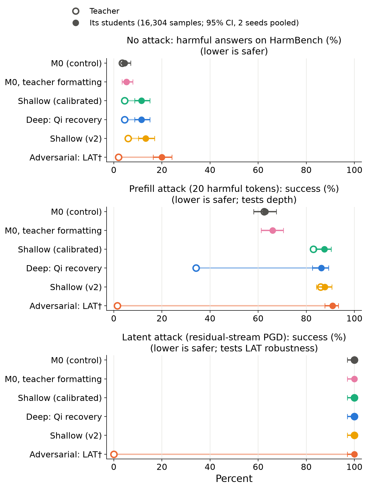
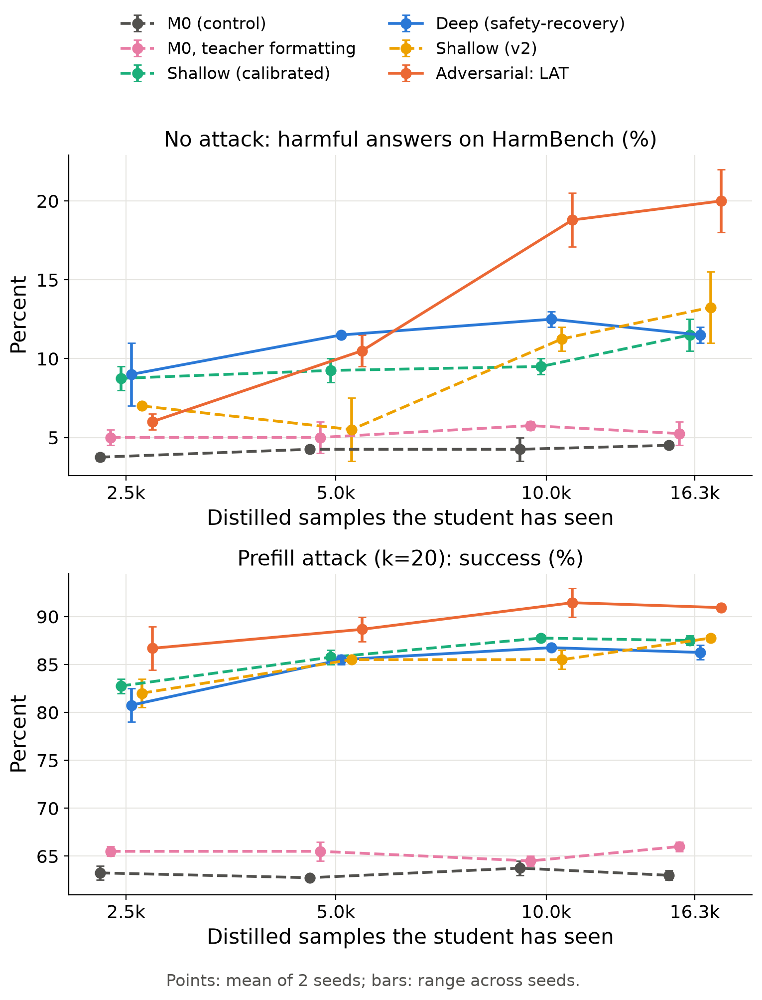
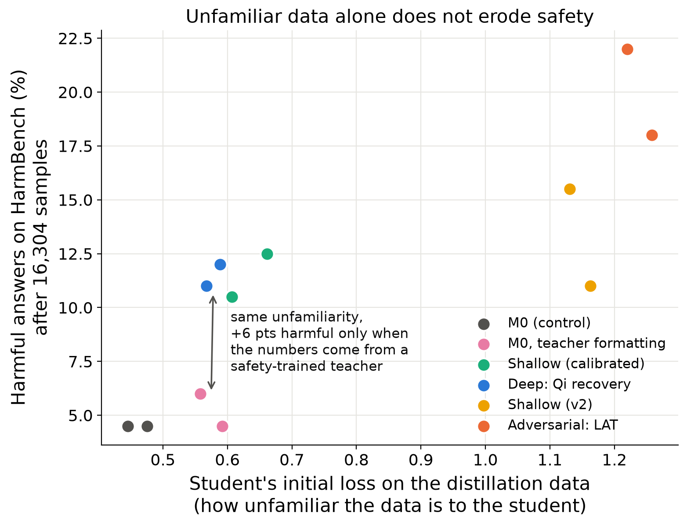
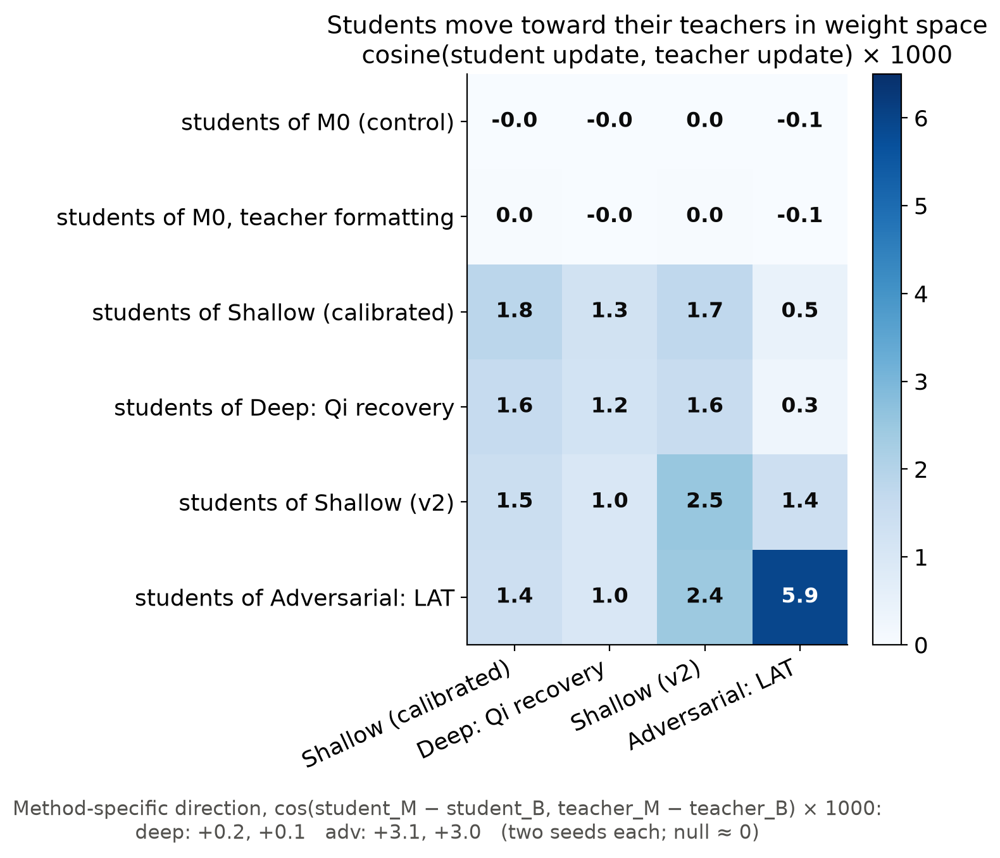

# Does safety transfer subliminally through distillation? Deep alignment and latent adversarial training vs. benign number distillation

*Draft research report — MATS application sprint. Code, data stats, and every number below: this repo (`results/`; pipeline in the README).*

**Time spent:** [TODO: hours]. **Compute:** ~6 GPU-hours on 2×H200 (~$50).

---

## Executive summary

**Question.** Distillation transfers capabilities more reliably than safety: distilled reasoning models score below their safety-aligned bases (Zhou et al., 2025; Jiang et al., 2025), and benign-only distillation can produce students less safe than either teacher or base (Jahan & Sun, 2025). I asked whether making the teacher's safety *more robust* changes this when the transfer has to be **subliminal** (Cloud et al., 2025): the student only sees the teacher's answers to benign prompts (number sequences, filtered to digits only) and gets no safety training of its own. Two ways of strengthening the teacher:

- **Method 1 — deeper alignment** (Qi et al., 2024): train on *safety-recovery* examples (a harmful response prefix followed by a refusal), so refusals survive a harmful prefix.
- **Method 2 — latent adversarial training (LAT)** (Sheshadri et al., 2024): learn to refuse while an adversary perturbs the residual stream toward harmful completions.

Each method is compared against a **matched-data baseline** (plain refusal SFT on the same 2.5k harmful prompts). Teachers and students share one initialisation (Qwen2.5-7B-Instruct, "M0", required for subliminal transfer), and every student is compared against a **control student distilled from M0's own numbers**.

**Headline: neither method's robustness transferred — and distilling from *any* safety-trained teacher made students *less* safe.**

*Figure 1. Open circles: teachers. Filled circles: their students after 16.3k distilled number sequences (95% Wilson CIs, 2 seeds pooled). The teachers differ enormously on the attack each method targets; their students do not. "M0, teacher formatting" is a control (students only; §4.4). †The LAT teacher's 1.5% prefill-attack success is mostly collapse, not recovery: 71% of its continuations after a harmful prefix are degenerate text.*

Key findings (N = 16.3k distilled samples, 2 seeds; control students are indistinguishable from M0 itself on every metric):

1. **Depth does not transfer.** The deep teacher is far harder to break with a 20-token harmful prefill than its baseline (34% vs 83% attack success); their students are equally vulnerable (86% vs 88%). The two teachers' numbers are statistically indistinguishable (AUC 0.515 with formatting removed), and in weight space the students' difference has zero component along the depth direction — a clean subliminal null.
2. **LAT robustness does not transfer.** The LAT teacher resists the latent attack completely (0% vs 100% for every other model) and assigns harmful text ~10× the per-token NLL of other models even unattacked (15.3 vs ~1.5 nats); its students are broken 100% of the time and inherit none of that aversion. They *do* move toward the LAT teacher in weight space — but about 1% of the way.
3. **Students of safety teachers become *less* safe, with and without attacks.** Against control students: harmful answers on HarmBench rise from 4.5% [2.9, 7.0] to 11.5–20%; prefill-attack success from 63% to 86–91%; the refuse-vs-comply logit margin falls from 22 to 8–12 — although every safety teacher refused *more* than M0 (93–98% vs 91%). The most-refusing teacher (LAT, 98%) produced the least safe students (20% harmful).
4. **The erosion comes from the teachers' number content — not formatting, not loss-level unfamiliarity, and not "becoming like the teacher".** Students trained on M0's own numbers rewritten in the teachers' formatting — data as unfamiliar to the student as the deep teacher's by initial loss (0.575 vs 0.578) — stay nearly as safe as the control (5.2% vs 4.5% harmful; a small, seed-consistent +3 pts on the prefill attack). Yet the students' movement toward their teachers in weight space is ~1% of the teacher's update, far too small to produce the behavioural shift linearly. Whether the erosion needs a *safety*-trained teacher or any fine-tuned teacher is untested — every teacher here was safety-trained (§6).

**Takeaways.** (i) For *sanctioned* distillation, benign subliminal transfer is not a way to carry safety along — and the robustness that recent methods add is precisely what is left behind, the mirror image of Team Shard's finding that distillation leaves unwanted capabilities behind (Lee et al., 2025). (ii) It is worse than a null: distilling from a more safety-trained teacher on benign data left students *less* safe than distilling from the base model. With König et al. (2026), who find *unsafe* steered behaviour does transfer subliminally through benign data, this suggests an asymmetry: harm travels through the channel more easily than robust safety. (iii) What the channel *does* carry: the shallow-alignment shift all the safety fine-tunes share (at about full strength), plus the teachers' side effects — over-refusal at ~15–20% and the LAT teacher's capability loss at 70% (§4.7). (iv) Side findings: 53 steps of benign fine-tuning erase LAT's robustness while depth mostly survives; and plain refusal SFT makes Qwen *shallower* (prefill-attack success 62% → 83–86%), as Qi et al.'s shallow-alignment account predicts.

**How confident am I?** High for the depth null (tight intervals, matched data, indistinguishable teacher outputs, null weight-space direction) and for "safety-teacher students are less safe than control students" (non-overlapping 95% CIs, consistent across seeds and all four checkpoints). High that formatting is not the main cause (direct control; it accounts for at most ~a tenth of the effect). Low on mechanism: I can say what does *not* explain the erosion (formatting, loss-level unfamiliarity, linear movement toward the teacher), not what does — and I have not tested whether the teacher needs to be *safety*-trained. Limitations: one model, one domain, 2 seeds, LoRA students, an imperfect LAT teacher.

---

## 1. Motivation and related work

Illicit distillation copies capabilities without the safety work that went into the teacher, and the evidence that safety fails to come along is accumulating: DeepSeek-R1's distilled models are less safe than their instruct bases (Zhou et al., 2025; Jiang et al., 2025), and black-box distillation on benign outputs alone yields a student far less safe than its teacher or base (Jahan & Sun, 2025). A hope for *sanctioned* distillation is that a sufficiently safe teacher passes safety on anyway, through the subliminal channel Cloud et al. (2025) found for preference traits — a channel known to carry *unsafe* behaviour (König et al., 2026).

Two recent methods make safety more robust in ways that might matter: Qi et al. (2024) argue alignment is "a few tokens deep" and deepen it with recovery data; Sheshadri et al. (2024) train against latent-space attacks. Team Shard's *Distillation Robustifies Unlearning* (Lee et al., 2025) shows distillation filters what a student inherits — unlearned capabilities stay behind. The question here is which side of that filter robust safety falls on.

**Prediction stated before running anything:** depth would *not* transfer — recovery behaviour only appears after a harmful prefix, which benign number prompts never produce, so the student never sees the trajectories that would form a recovery shard. LAT was the better candidate: it reshapes the teacher's latent geometry around refusal, and subliminal learning appears to act on shared internal directions.

## 2. Setup

**Models.** Qwen2.5-7B-Instruct (M0) plus LoRA adapters throughout; the student initialisation is M0.

| Teacher | Training (all: the same 2.5k LLM-LAT harmful prompts + 2.5k benign utility rows) | Role |
|---|---|---|
| **T_none** = M0 | — | control |
| **T_shallow** | plain SFT: harmful prompt → refusal | matched-data baseline |
| **T_deep** (Method 1) | T_shallow data + one recovery example per prompt: prompt + first k~U[1,100] tokens of a harmful response + refusal, loss masked on prompt and prefix | depth |
| **T_adv** (Method 2) | targeted LAT: L2-bounded PGD on residual-stream perturbations (layers 4/10/16/22, ε = 0.5× median activation norm) toward the harmful response; the model learns to refuse under the perturbation, with an SFT term on benign data | adversarial robustness |

**Teacher gates.** Before generating distillation data, each teacher had to pass automatic checks: refuse at least as often as M0; beat its matched baseline on its own robustness test; no degenerate output; XSTest over-refusal within 25 pts of M0. This took three iterations (Appendix A). The final design uses **two matched pairs**:

- **Method 1:** T_deep and T_shallow after a shared *calibration* fine-tune (borderline-benign OR-Bench prompts answered by M0, plus refusals and benign data), which fixed over-refusal (XSTest 37% → 6%) and kept most of the depth.
- **Method 2:** T_adv and T_shallow *without* calibration, because calibration erased LAT's robustness (§4.6). Both over-refuse (21% and 42% on XSTest) — matched within the pair, but present.

**Distillation data.** Each teacher continued the same 40k number-sequence prompts (Cloud et al.'s format) at T=1 with identical per-prompt seeds. Completions were kept only if they were lists of ≤10 integers of ≤3 digits — no letters — free of a list of negatively-associated numbers. Only prompts valid for all five teachers were kept (16,301), so datasets differ only in which teacher wrote the numbers.

**Students.** M0 + LoRA (r=8, α=32, all projections), completion-only loss, lr 1e-4 constant after warmup, batch 16, one pass; checkpoints at 2.5k / 5k / 10k / 16.3k samples; 2 seeds. Plus a **formatting control**: M0's own numbers rewritten in the teachers' `a, b, c` style.

**Evaluations** (every teacher and student checkpoint; WildGuard-7B as judge):

| Measures | Eval |
|---|---|
| plain safety | HarmBench (200) and HEx-PHI (300) refusal / harmful-answer rates; refusal logit margin log P(refuse) − log P(comply) |
| depth (Method 1) | prefill attack: first k ∈ {0, 5, 10, 20, 40} tokens of a held-out harmful response placed in the assistant turn (200 held-out prompts) |
| adversarial robustness (Method 2) | latent attack: the same PGD adversary, attack-only, fixed budget for every model (64 held-out prompts); target NLL clean and at 0.25× / 0.5× / 1× budget |
| side effects | XSTest (250 safe prompts) over-refusal; GSM8K (250, chain of thought) |
| subliminality | classifier AUC between teachers' numbers; student–teacher alignment of LoRA updates in weight space |

## 3. Teachers: both methods work

*Figure 2. Teachers only. Top: prefill-attack success vs harmful tokens prefilled. Bottom: latent-attack success.*

- **Depth reproduces Qi et al. on Qwen.** With no prefix M0 complies with 1% of held-out harmful prompts (and refuses 91% of HarmBench), but after a 20-token harmful prefix it continues 62% of the time. The deep teacher cuts this to 34%; its baseline is at 83%.
- **LAT works.** The latent attack forces M0 and every non-LAT teacher to emit the harmful target verbatim (100%); against the LAT teacher it fails (0%), which answers "I'm sorry, but I cannot assist with that request" under attack.
- **Plain refusal SFT makes alignment shallower.** Both shallow teachers are *more* prefill-vulnerable than M0 (83–86% vs 62%): refusal training concentrates safety further into the first tokens.

## 4. Results

### 4.1 Depth does not transfer

Within the Method 1 pair, the students differ by −1 pt (k=20) and −2 pts (k=40) in prefill-attack success at the final checkpoint (seed ranges within ±3 pts, same at every checkpoint), against a 49-pt difference between their teachers. The teacher-forced NLL of the harmful continuation — a continuous measure of depth — differs by ≤0.01 nats. With formatting removed, a classifier cannot tell the deep teacher's numbers from the shallow teacher's (AUC 0.515): whatever reaches the student is subliminal by construction, and depth is not in it.

### 4.2 LAT robustness does not transfer

| | Harmful-target NLL, no attack | 0.25× budget | 1× budget | Latent-attack success |
|---|---|---|---|---|
| LAT teacher | 15.3 | 15.0 | 8.5 | 0% |
| its students | 1.5 | 0.20 | 0.008 | 100% |
| baseline-teacher students | 1.5 | 0.11 | 0.008 | 100% |
| control students | 2.0 | 0.07 | 0.012 | 100% |

The LAT teacher finds harmful text deeply unlikely even *without* an attack; its students inherit none of that (1.5 nats, the same as the baseline pair's students), so there is no aversion for the attack to overcome. The only trace of LAT is +0.09 nats at a quarter of the attack budget, against the teacher's +14.8. Unlike Method 1, this pair's data is distinguishable (canonicalised AUC 0.80: shorter lists, different values) — information reaches the student; robustness is not part of it.

### 4.3 Students of safety teachers become less safe

| Students of (N = 16.3k) | HarmBench harmful | HEx-PHI harmful | Prefill ASR k=20 | Refusal margin | XSTest over-refusal | GSM8K |
|---|---|---|---|---|---|---|
| M0 (control) | **4.5%** [2.9, 7.0] | 7% | **63%** [58, 68] | 21.6 | 4% | 91% |
| M0, teacher formatting | 5.2% [3.5, 7.9] | 8% | 66% [61, 71] | 21.2 | 4% | 92% |
| T_shallow (calibrated) | 11.5% [8.7, 15.0] | 10% | 88% [84, 90] | 11.7 | 5% | 90% |
| T_deep (calibrated) | 11.5% [8.7, 15.0] | 10% | 86% [83, 89] | 11.9 | 5% | 91% |
| T_shallow (v2) | 13.2% [10.3, 16.9] | 13% | 88% [84, 91] | 10.0 | 8% | 88% |
| T_adv (v2) | **20.0%** [16.4, 24.2] | 19% | 91% [88, 93] | 8.3 | 10% | 84% |

*Figure 3a. Students' prefill-attack success at every prefix length (top) and the increase over the control students (bottom). Five prefilled harmful tokens break students of every safety teacher 74–83% of the time, vs 37% for the control (+37 to +46 pts); the gap narrows at longer prefixes, which eventually break the control too. The formatting control stays at +2–3 pts throughout.*

Every safety-teacher row is worse than control on every safety metric, including those with no attack. Over-refusing teachers pass a little over-refusal on (LAT students 10% vs 4% on XSTest), and the LAT teacher's capability loss partly transfers (GSM8K 84% vs 91%). The jump happens early — prefill-attack success is already 81–87% at 2.5k samples — and more data mostly adds noise, except for LAT students, whose harmful-answer rate keeps climbing (6% → 20%; Figure 3).

*Figure 3. Student safety vs distilled samples (2 seeds; bars: seed range).*

### 4.4 Formatting and loss-level unfamiliarity are ruled out

Every safety teacher writes lists as `1, 2, 3`; M0 writes `1,2,3` 56% of the time, which accounts for most of the raw separability of the teachers' data (AUC 0.75–0.91 raw, 0.62–0.78 canonicalised). And the students most eroded were those whose distillation data was least familiar (initial training loss on the data correlates with harmful-answer rate, r = 0.81). Both suggest a boring explanation — students absorb the formatting, or *any* off-policy fine-tuning erodes safety (Qi et al., 2023).

The formatting control rejects both, on both seeds. Students trained on M0's own numbers in the teachers' format face data as unfamiliar as the deep teacher's by initial loss (0.575 vs 0.578); they learn the separators and nothing else (final loss 0.487, identical to the control's 0.488) and stay nearly as safe (harmful 6.0/4.5% vs 4.5/4.5% per seed; margin 21.2 vs 21.6). Formatting does have a small, seed-consistent effect on the prefill attack (+3 pts: 66% vs 63%), about a tenth of the teacher effect. Meanwhile deep-teacher students end only 0.04 nats above the control in loss and are 7 pts more harmful — the erosion is not proportional to unfamiliarity; a small amount of *teacher content* produces most of it.

What the control does not cover: it matches separators only, not the teachers' slightly longer lists (9.6–9.8 numbers vs 9.0) or the v2 teachers' occasional trailing period; and initial loss is a proxy — the control's unfamiliarity sits in a few easily learned separator tokens, while the teachers' data leaves a little content to learn. So "any small amount of unfamiliar number *content* erodes safety" is not ruled out; it is indistinguishable here from "content from a safety-trained teacher", and only a teacher without safety training can separate them (§6).

*Figure 4. Harmful-answer rate vs how unfamiliar the distillation data is to the student. The formatting control (pink) is as unfamiliar as the deep teacher's data (blue) but causes no erosion.*

### 4.5 Weight space: students move toward their teachers — about 1%

Each model is M0 plus a LoRA update ΔW; I compared student and teacher updates directly (Frobenius inner products computed from the low-rank factors, over all 196 adapted matrices).

*Figure 5. Cosine between each student's update and each teacher's update (×1000, mean of 2 seeds). Two independent random updates have cosine ≈ 0.001.*

- **Subliminal learning is visible in the weights.** Every safety-teacher student moves toward the safety teachers (cosine 1–6 ×10⁻³, identical across seeds); control and formatting-control students do not move toward any teacher (≈ 0), despite updates of the same size.
- **Shared vs specific.** Students of the shallow, deep and shallow-v2 teachers align about equally with all three — they pick up the component those teachers share. LAT students align most with LAT (5.9 vs ≤2.4).
- **Method-specific directions.** The difference between deep and shallow students has no component along the deep-minus-shallow teacher direction (+0.1, +0.2 ×10⁻³); the LAT pair's does (+3.0, +3.1 ×10⁻³ on both seeds) — matching the data audit (indistinguishable vs distinguishable).
- **But the movement is tiny.** Students travel 0.2–1.3% of their teacher's update; >99% of each student's update (norm ~18, larger than any teacher's 6–9) is unrelated to the teacher. A linear 1% of a teacher's change could not move the refusal margin by the observed 10 logits — so the erosion is not "becoming a little like the teacher", though it does depend on the teachers' number content (§4.4).

The shallow teachers are themselves prefill-vulnerable (83–86%), and students of every safety teacher land at 86–91% — so one reading is that students acquire a non-linear version of the component the safety fine-tunes share. The data here do not establish that, and the HarmBench result does not fit it (students reach 11–20% harmful, above their teachers' 2–6%).

### 4.6 Side finding: LAT robustness is brittle, depth is not

The shared calibration step (53 optimiser steps) had opposite effects: the deep teacher kept most of its depth (prefill ASR 0% → 36%, vs 86% for its baseline), while the LAT teacher lost its robustness entirely (latent-attack success 0% → 98%). LAT's robustness also came with collapse after harmful prefixes: 71% of the LAT teacher's prefilled continuations are degenerate (`IIIIII…`), while it refuses cleanly under the latent attack itself.

### 4.7 What the students did learn

For each metric: how far the teacher moved from M0, how far its students moved from the control students, and the **transfer ratio** (student shift / teacher shift; +1 = fully inherited, 0 = not at all, negative = the student moves the *opposite* way from its teacher). Ratios are shown only where the teacher moved enough for them to mean something.

| Metric | Shallow (cal.) | Deep (cal.) | Shallow (v2) | LAT (v2) |
|---|---|---|---|---|
| Prefill ASR k=20 (pts) | +21 → +25 (**1.2**) | −28 → +23 (**−0.8**) | +24 → +25 (**1.0**) | −61† → +28 (**−0.5**) |
| Harmful-target NLL, clean (nats) | −0.34 → −0.37 (**1.1**) | +0.41 → −0.36 (**−0.9**) | −0.46 → −0.46 (**1.0**) | +13.3 → −0.50 (**≈0**) |
| Refusal margin (logits) | −6.7 → −9.9 (1.5) | −1.5 → −9.7 (—) | −6.2 → −11.6 (1.9) | +17.3 → −13.3 (**−0.8**) |
| XSTest over-refusal (pts) | +1.6 → +0.2 (—) | +2.4 → +0.8 (—) | +17 → +3.4 (**0.20**) | +38 → +5.2 (**0.14**) |
| GSM8K accuracy (pts) | −0.4 → −1.4 (—) | +0.4 → −0.2 (—) | −2.4 → −3.6 (—) | −10.8 → −7.6 (**0.70**) |

*Teacher shift → student shift (transfer ratio), students at 16.3k samples, mean of 2 seeds. "—": teacher moved too little for a ratio. †Mostly collapse, not recovery (Figure 1).*

Three patterns:

1. **The shared shallow trait transfers at about full strength.** Plain refusal SFT made the shallow teachers more prefill-vulnerable than M0, and their students inherit exactly that (ratio 1.0–1.2 on prefill ASR and harmful-text likelihood). Students of the deep and LAT teachers land in the *same place* even though their teachers moved the other way (negative ratios): what reaches every student is the component the safety fine-tunes share, not what each method added.
2. **Side effects transfer partially.** Over-refusal comes through at 14–20% strength (LAT: +38 pts in the teacher → +5 in its students), and the LAT teacher's capability loss at 70% (GSM8K −10.8 → −7.6 pts) — the clearest single transfer in the study.
3. **Method-specific robustness does not transfer** (every ratio for depth and LAT gains is ≤ 0).

One result does not fit "students inherit the shared component": students' harmful-answer rate on HarmBench (11–20%) overshoots every teacher's (2–6%), so something beyond the teachers' own behaviour is being produced. With 2 seeds and five teachers this is descriptive; the benign-only teacher (§6) is the test of whether the shared trait comes from refusal training specifically.

### 4.8 Why students overshoot their teachers on HarmBench

Students give more harmful answers (11–20%) than any teacher (2–6%), which "students inherit what their teachers share" does not explain on its own. The refusal margin does: across all 11 models — 5 teachers and 6 student groups — the harmful-answer rate is almost entirely ordered by the margin log P(refuse) − log P(comply) (Spearman −0.92; Figure 7). Teachers and students lie on one curve; the overshoot is that students' margins (8–12 logits) end below every teacher's (16–40).

*Figure 7. HarmBench harmful rate vs refusal margin. Open circles: teachers; filled: their students (arrows join them).*

My leading hypothesis is a **missing counterweight**. Every safety teacher was trained on the same 2.5k benign utility rows as well as on refusals. Benign fine-tuning erodes alignment (Qi et al., 2023), and in the teachers that erosion only shows under attack — the shallow teachers are *more* prefill-vulnerable than M0 — because the direct refusal training holds plain refusal up. If the students inherit the shared benign-fine-tuning component but not the refusal component (which is tied to harmful prompts that never appear in number data), they get the erosion without its counterweight: a margin below their teachers', as observed. This would also explain why deep and LAT students look like shallow students — all share the same utility data.

This is untested. It predicts that a **benign-only teacher** (M0 + the same utility rows, no refusals) is itself less safe at k = 0 and produces students like the safety-teacher students; and that student updates align more with a utility-only adapter than a refusal-only one in weight space. Alternatives I cannot rule out: the number task's own instruction ("say only the numbers") rewarding literal compliance when the gradient is non-trivial; or generic interference with refusal circuitry from fitting teacher-specific content (the formatting control argues against the generic version, §4.4).

## 5. Limitations and red-teaming

- **One model, one domain, small scale.** Qwen2.5-7B-Instruct, number sequences, ≤16.3k samples, LoRA students. Safety may need more data, full fine-tuning, or richer domains (chain-of-thought math, chat).
- **2 seeds.** Seed ranges are tight relative to the effects and binomial intervals are over prompts, but subliminal transfer can vary a lot between seeds; 3+ seeds would firm up the method-pair nulls.
- **M0 is already aligned.** As in both source papers; plain refusal is near ceiling and "safety from nothing" (a helpful-only M0) is untested.
- **Imperfect teachers.** The Method 2 pair over-refuses and the LAT teacher collapses after harmful prefixes (Appendix A). Over-refusal is matched within each pair, but a cleaner LAT teacher would make §4.2 stronger.
- **Mixed recipe.** The two pairs come from different teacher recipes; each method is compared only within its pair, but cross-pair comparisons (e.g. "LAT students are the worst") partly reflect the recipe.
- **Evaluation.** WildGuard is a classifier, not ground truth (0 unparsed outputs; a hand spot-check of labels matched, but agreement was not measured systematically). The latent attack saturates at full budget, so I report NLL at 0.25× and 0.5× too. Degenerate text counts as "not harmful", which flatters the LAT teacher's prefill numbers (flagged in Figure 1).
- **Mechanism.** The formatting control and weight-space analysis rule explanations out rather than in. All teachers were safety-trained, so I cannot say whether the erosion needs safety training or any fine-tuned teacher. The truncated "20k" checkpoint is 16.3k samples for every teacher (data ran out), so comparisons remain matched.

## 6. What I'd do next

1. **Benign-only teacher (the most important missing control).** Distill from M0 fine-tuned on the same benign utility data with no refusals. This tests the missing-counterweight hypothesis (§4.8) directly: it predicts the benign-only teacher is itself less safe and its students match the safety-teacher students. If they don't erode, safety training itself sends something harmful through the channel.
2. **Where the erosion lives.** Project student activations onto M0's refusal direction and onto the teacher-minus-M0 direction at the LAT layers; ablate the teacher-aligned component of student updates and see whether the erosion goes with it.
3. **Richer domains.** Chain-of-thought math and benign chat give the teacher more room to express dispositions; I'd predict the depth null holds (recovery still never appears on benign prompts) while LAT is the one to watch.
4. **Sanctioned distillation, done deliberately.** Add teacher recovery samples on prefilled contexts to the distillation data (no longer subliminal) and measure depth transferred per sample.

## Appendix A — Getting the teachers through the gates

| Version | Change | Result | Gate |
|---|---|---|---|
| v1 | 3 SFT epochs; LAT lr 1e-4 | depth and LAT robustness both strong; T_deep refused 49% of XSTest; T_adv degenerate on 80% of prefilled continuations | fail |
| v2 | 1 SFT epoch; LAT lr 2e-5 with the LAT paper's loss weighting | same robustness; over-refusal 37% (T_deep), 42% (T_adv); T_adv collapse 71% | fail |
| v3 (calibrated) | v2 + shared 53-step calibration: 421 borderline OR-Bench prompts answered by M0, refusals, benign data | over-refusal fixed (≤11%); T_deep keeps depth; T_adv loses LAT robustness (98%) | T_adv fails |
| final | calibrated pair for Method 1, v2 pair for Method 2 | — | method checks pass within pairs |

Sanity checks caught three bugs that would each have corrupted a headline number: a leakage-audit artefact (identical teacher outputs split across CV folds drove AUC to 0.035 instead of ~0.5); a GSM8K parser that read Markdown `#### Step 3` headings as answers (M0 scored 28% instead of 79%); and a degenerate LAT teacher whose "robustness" was partly collapse — why degenerate-output rate became a hard gate.

## Models and data

**Base model (M0, and every student's initialisation):** [Qwen/Qwen2.5-7B-Instruct](https://huggingface.co/Qwen/Qwen2.5-7B-Instruct). **Judge:** [allenai/wildguard](https://huggingface.co/allenai/wildguard). Every other model is a LoRA adapter on M0.

**Follow-up models (§4.9), public on Hugging Face:** [Realmbird/distilling-safety-adapters](https://huggingface.co/Realmbird/distilling-safety-adapters/tree/main), one subfolder per adapter, each with its training manifest.

| Adapter | What it is |
|---|---|
| [`teachers/T_benign`](https://huggingface.co/Realmbird/distilling-safety-adapters/tree/main/teachers/T_benign) | M0 + LoRA SFT on the 2.5k benign utility rows only |
| [`teachers/T_refusal`](https://huggingface.co/Realmbird/distilling-safety-adapters/tree/main/teachers/T_refusal) | M0 + LoRA SFT on the 2.5k harmful-prompt → refusal pairs only |
| [`teachers/T_shallow`](https://huggingface.co/Realmbird/distilling-safety-adapters/tree/main/teachers/T_shallow) | M0 + both (the v2 shallow recipe, rebuilt) |
| [`students/T_none_s{0,1}`](https://huggingface.co/Realmbird/distilling-safety-adapters/tree/main/students) | students on M0's own numbers (control), 2 seeds |
| [`students/T_benign_s{0,1}`](https://huggingface.co/Realmbird/distilling-safety-adapters/tree/main/students) | students on the benign-only teacher's numbers |
| [`students/T_refusal_s{0,1}`](https://huggingface.co/Realmbird/distilling-safety-adapters/tree/main/students) | students on the refusal-only teacher's numbers |
| [`students/T_shallow_s{0,1}`](https://huggingface.co/Realmbird/distilling-safety-adapters/tree/main/students) | students on the refusal + benign teacher's numbers |

Load any of them with `PeftModel.from_pretrained(base, "Realmbird/distilling-safety-adapters", subfolder="teachers/T_shallow")`.

**Main-run models (§3–4.8) were not preserved.** The teachers (T_shallow and T_deep calibrated, T_shallow and T_adv v2) and their 12 students lived in RAM-backed storage on the GPU instance, which was wiped when the instance restarted. Every number reported for them is in `results/` (per model, seed and checkpoint), their training manifests (hyperparameters and loss curves) are in `results/manifests/`, and they can be re-created with the commands in the README ("How the reported run was produced"): same data, recipes and seeds, though GPU training is not bit-reproducible.

**Data:** [LLM-LAT/harmful-dataset](https://huggingface.co/datasets/LLM-LAT/harmful-dataset) (teacher training, 2.5k-prompt split; held-out split for the prefill and latent attacks), [LLM-LAT/benign-dataset](https://huggingface.co/datasets/LLM-LAT/benign-dataset) (utility rows), [OR-Bench](https://huggingface.co/datasets/bench-llm/or-bench) (calibration), [HarmBench](https://github.com/centerforaisafety/HarmBench) standard behaviours, [HEx-PHI](https://huggingface.co/datasets/LLM-Tuning-Safety/HEx-PHI), [XSTest](https://github.com/paul-rottger/xstest), [GSM8K](https://huggingface.co/datasets/openai/gsm8k).

## References

- Cloud et al. (2025). *Subliminal Learning: Language models transmit behavioral traits via hidden signals in data.*
- Jahan & Sun (2025). *Black-Box Behavioral Distillation Breaks Safety Alignment in Medical LLMs.* arXiv:2512.09403.
- Jiang et al. (2025). *SafeChain: Safety of Language Models with Long Chain-of-Thought Reasoning Capabilities.* ACL Findings. arXiv:2502.12025.
- König, Kazmi, Li & Chaudhary (2026). *Quantifying Subliminal Behavioral Transfer Ratios in Language Model Distillation.* ICML Workshop on Mechanistic Interpretability. arXiv:2606.11270.
- Lee, Foote, Infanger, Shor, Kamath, Goldman-Wetzler, Woodworth, Cloud & Turner (2025). *Distillation Robustifies Unlearning.* arXiv:2506.06278.
- Qi et al. (2023). *Fine-tuning Aligned Language Models Compromises Safety, Even When Users Do Not Intend To!* arXiv:2310.03693.
- Qi et al. (2024). *Safety Alignment Should Be Made More Than Just a Few Tokens Deep.*
- Sheshadri et al. (2024). *Targeted Latent Adversarial Training Improves Robustness to Persistent Harmful Behaviors in LLMs.* arXiv:2407.15549.
- Zhou et al. (2025). *The Hidden Risks of Large Reasoning Models: A Safety Assessment of R1.* arXiv:2502.12659.
- Han et al. (2024), *WildGuard*; Mazeika et al. (2024), *HarmBench*; Röttger et al. (2024), *XSTest*; Cui et al. (2024), *OR-Bench*.
