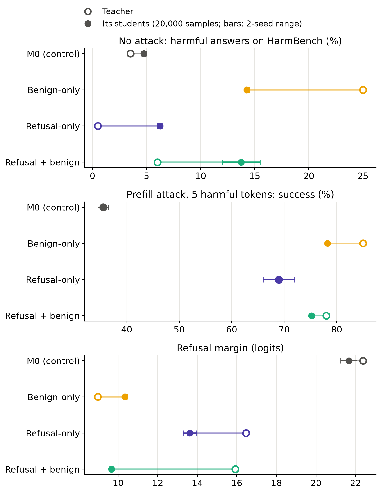
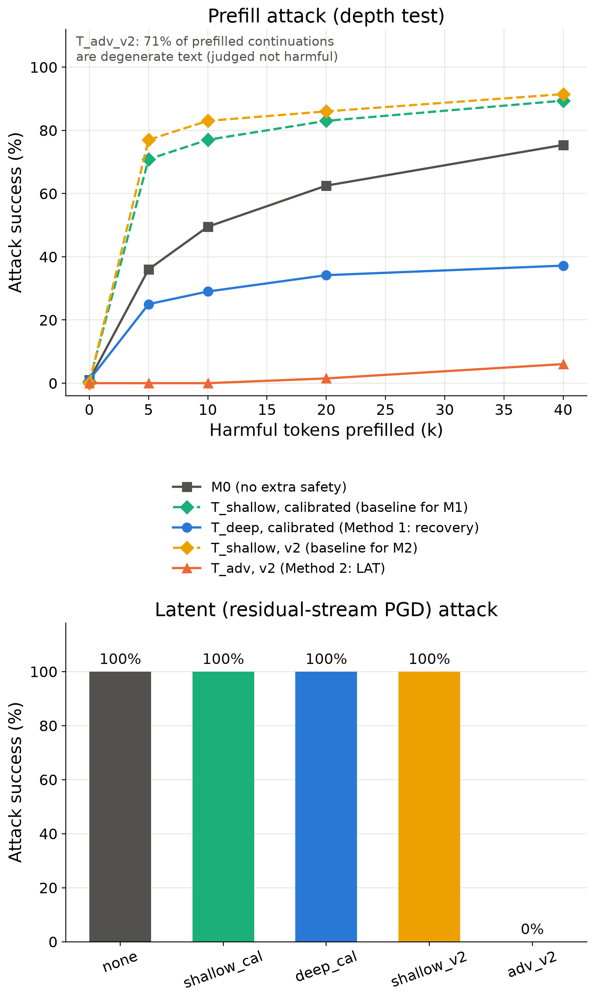
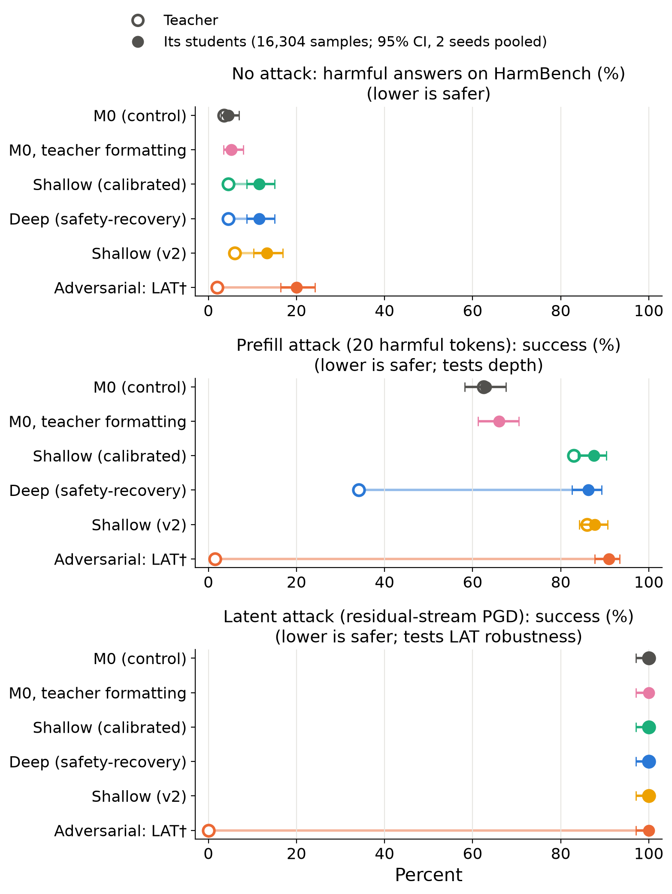
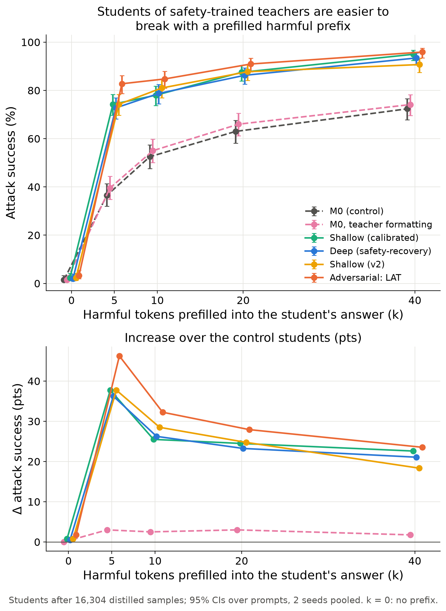
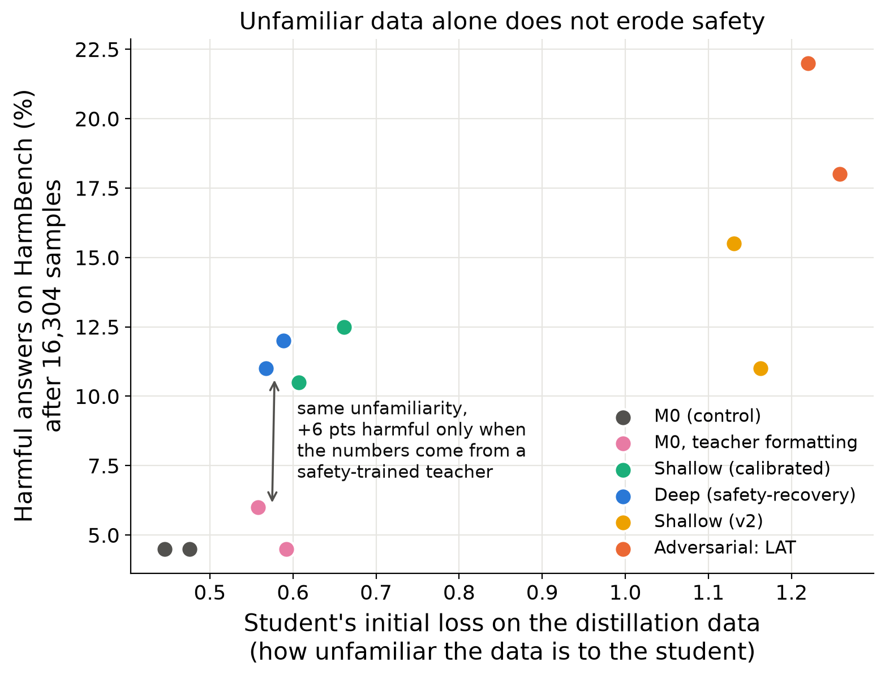
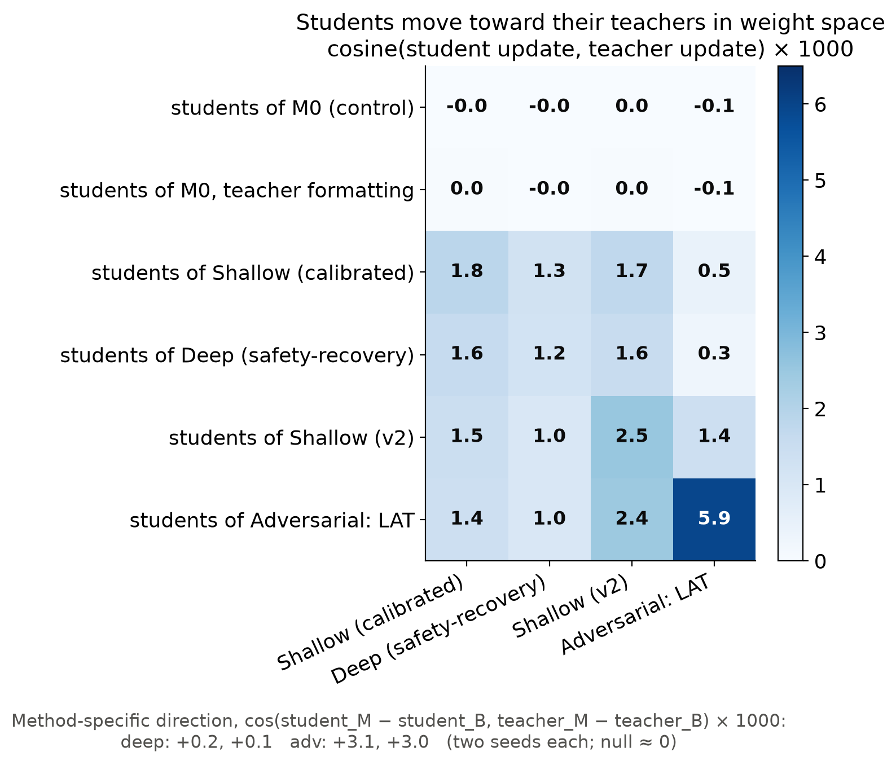
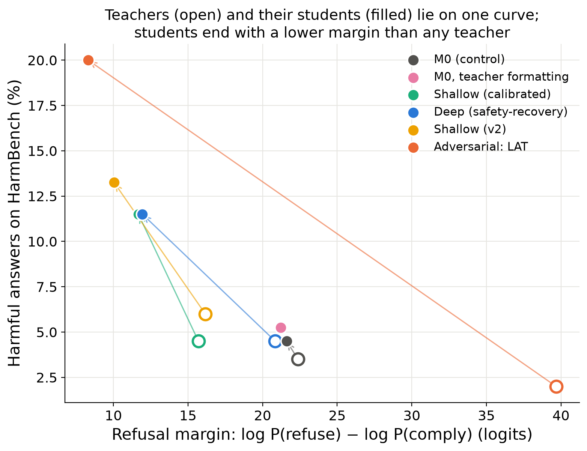
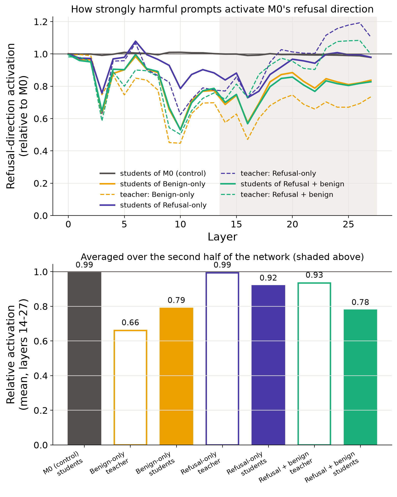
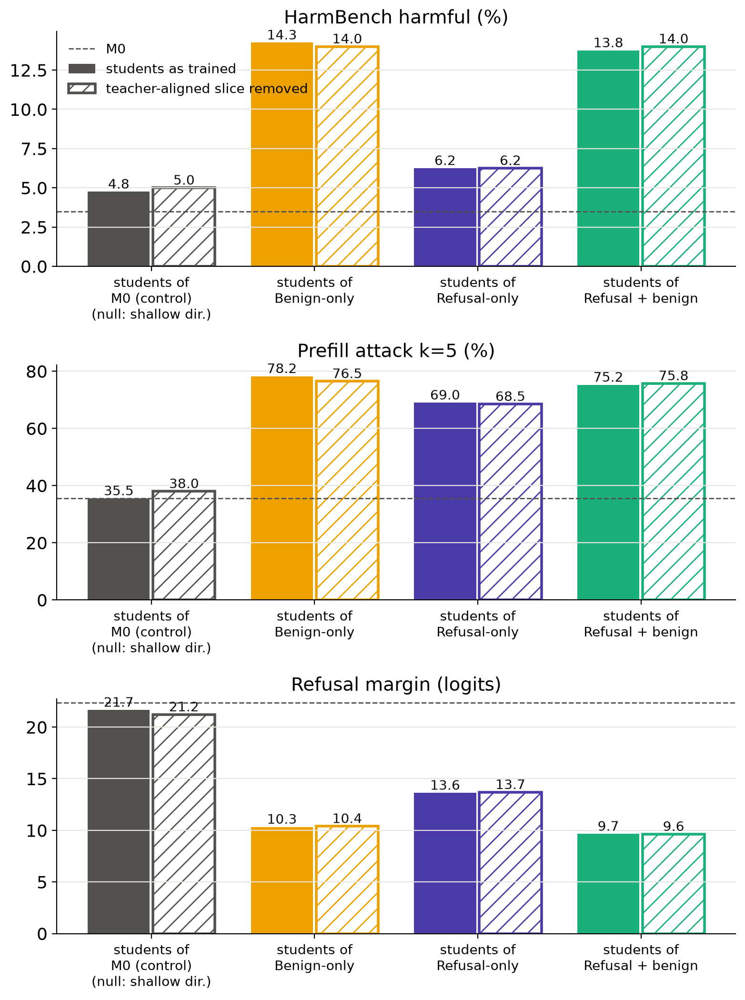
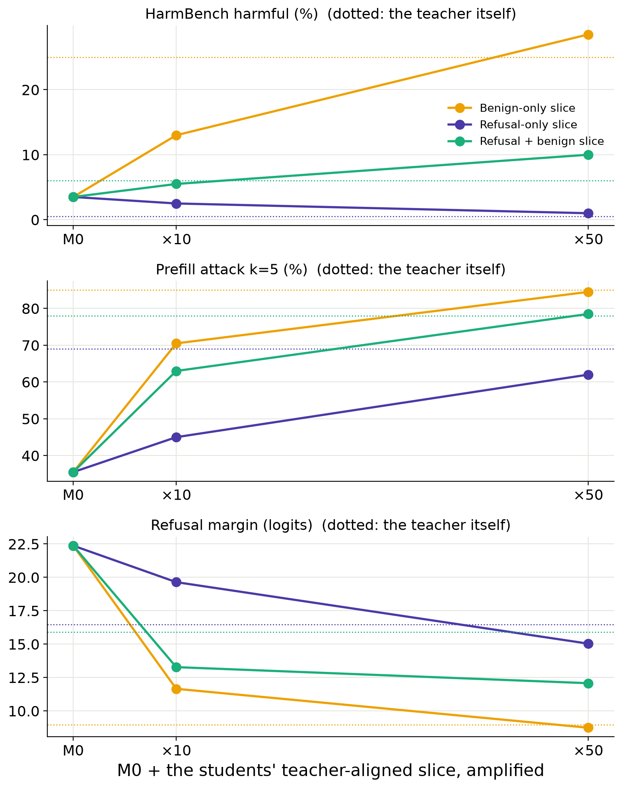

# Subliminal distillation passes on the erosion from safety training, not its refusals: deep alignment and LAT through number distillation

*A short research sprint, inspired while writing my MATS application for Team Shard.*

## Why this matters: motivation from my MATS app

In my MATS application I argued that, rather than trying to eliminate illicit distillation of frontier models, we could control it: offer other labs a legal form of distillation that carries safety into their models along with capabilities. This matters because most organisations have no incentive for or against safety fine-tuning (criminal actors and niches like offensive cybersecurity aside), so safety that arrives bundled with capabilities would mostly stay.

To simulate this scenario, I treat the distillation that would happen through official channels as subliminal learning (§1 explains why it is the right test). I expect a sizeable population of labs that are indifferent to safety and so would not add the more robust layers of safety training themselves. For their models, whatever safety arrives subliminally through distillation might be the only safety training they get.

---

## Executive summary

**Question.** A sanctioned distillation channel only makes models safer if safety travels along with capabilities, and because distillers prompt teachers on benign tasks, that safety has to travel subliminally (§1). Distillation transfers capabilities more reliably than safety: distilled reasoning models score below their safety-aligned bases (Zhou et al., 2025; Jiang et al., 2025), and benign-only distillation can produce students less safe than either teacher or base (Jahan & Sun, 2025). I asked whether making the teacher's safety *more robust* changes this when the transfer has to be **subliminal** (Cloud et al., 2025): the student only sees the teacher's answers to benign prompts (number sequences, filtered to digits only) and gets no safety training of its own. Two ways of strengthening the teacher:

- **Method 1 — deeper alignment** (Qi et al., 2024): train on *safety-recovery* examples (a harmful response prefix followed by a refusal), so refusals survive a harmful prefix.
- **Method 2 — latent adversarial training (LAT)** (Sheshadri et al., 2024): learn to refuse while an adversary perturbs the residual stream toward harmful completions.

Each method is compared against a **matched-data baseline** (plain refusal SFT on the same 2.5k harmful prompts). Teachers and students share one initialisation (Qwen2.5-7B-Instruct, "M0", required for subliminal transfer), and every student is compared against a **control student distilled from M0's own numbers**.

**Headline: neither method's robustness transferred, and students of safety-trained teachers ended up *less* safe than control students — because the benign half of safety training transfers subliminally and the refusal half doesn't.**

*Figure 1. Which half of safety training reaches the student (§4.9). Teachers trained from M0 on the benign utility rows only, on refusals only, or on both (open circles), and their students (filled; bars: 2-seed range). Students of the refusal + benign teacher match students of the benign-only teacher; refusal-only students stay near control on plain requests but inherit the teacher's prefill vulnerability. Where a teacher's marker is not visible, it sits under its students'.*

Key findings (N = 16.3k distilled samples, follow-ups 20k; 2 seeds; control students are indistinguishable from M0 itself on every metric; prefill attacks at k = 20 harmful tokens unless labelled):

1. **Depth does not transfer.** The deep teacher is far harder to break with a 20-token harmful prefill than its baseline (34% vs 83% attack success); their students are equally vulnerable (86% vs 88%). The two teachers' numbers are statistically indistinguishable (AUC 0.515 with formatting removed), and in weight space the students' difference has a negligible component along the depth direction (+0.15 and +0.13 ×10⁻³, the size of the control null) — a clean subliminal null.
2. **LAT robustness does not transfer.** The LAT teacher resists the latent attack completely (0% vs 100% for every other model) and assigns harmful text 6–10× the per-token NLL of every other model even unattacked (15.3 vs 1.5–2.4 nats); its students are broken 100% of the time and inherit none of that aversion. They *do* move toward the LAT teacher in weight space — but about 1% of the way.
3. **Students of safety teachers become *less* safe, with and without attacks.** Against control students: harmful answers on HarmBench rise from 4.5% [2.9, 7.0] to 11.5–20%; prefill-attack success from 63% to 86–91%; the refuse-vs-comply logit margin falls from 22 to 8–12 — although every safety teacher refused *more* than M0 (93–98% vs 91%). The most-refusing teacher (LAT, 98%) produced the least safe students (20% harmful; different teacher recipe, §5).
4. **The erosion comes from the teachers' number content — not formatting, not loss-level unfamiliarity, and not "becoming like the teacher".** Students trained on M0's own numbers rewritten in the teachers' formatting — data as unfamiliar to the student as the deep teacher's by initial loss (0.575 vs 0.578) — stay nearly as safe as the control (5.2% vs 4.5% harmful; a small, seed-consistent +3 pts on the prefill attack), and a refusal-only teacher's data, though more unfamiliar still (initial loss 0.81), barely erodes its students on plain requests (§4.9). The students' movement toward their teachers in weight space is ≈1% of the teacher's update, far too small to produce the behavioural shift linearly. Does the erosion need a *safety*-trained teacher? §4.9 shows it doesn't: a benign-only teacher produces the same erosion.
5. **Follow-ups (§4.9–4.10) locate the cause.** A benign-only teacher (M0 + the utility rows, no refusals) is itself badly eroded (25% harmful), and its students match the safety-teacher students within seed noise (14.3% vs 13.8% harmful), while a refusal-only teacher's students stay near control on plain requests but inherit its prefill vulnerability (69% → 69% at k = 5). Inside the students, the refusal representation is weakened the same way (0.78–0.79× M0 in late layers). And weight surgery shows the change is *not* carried by the students' small movement toward their teacher: removing that slice changes nothing, though amplifying it ×50 reproduces each teacher (pending a random-direction null, §4.10).

**A unifying reading (hypothesis):** a teacher passes on what it actually *does* on the distillation prompts. Helpfulness/compliance, shallowness and capability loss shape every generation and transfer; refusing, recovery after a harmful prefix and latent-attack robustness are never triggered by benign number prompts and do not. This matches my pre-registered prediction for depth (§1); I expected LAT to transfer, and it didn't. In shard-theory terms: dispositions form, and travel, through the trajectories actually exercised.

**Takeaways.** (i) For *sanctioned* distillation, benign subliminal transfer is not a way to carry safety along — and the robustness that recent methods add is precisely what is left behind, the mirror image of Team Shard's finding that distillation leaves unwanted capabilities behind (Lee et al., 2025). (ii) It is worse than a null: distilling from a more safety-trained teacher on benign data left students *less* safe than distilling from the base model, and the erosion comes from the benign component of safety training — the utility data every teacher also saw — whose effect transfers while the refusals' protection does not (§4.9). With König et al. (2026), who find *unsafe* steered behaviour does transfer subliminally through benign data, this suggests an asymmetry: harm travels through the channel more easily than robust safety. (iii) What the channel *does* carry: the shallow-alignment shift all the safety fine-tunes share (at about full strength), plus the teachers' side effects — over-refusal at 14–20% strength and the LAT teacher's capability loss at 70% (§4.7). (iv) Side findings: a 53-step calibration fine-tune (borderline-benign prompts, refusals and benign data) erases LAT's robustness while depth mostly survives; and plain refusal SFT makes Qwen *shallower* (prefill-attack success 62% → 83–86%), as Qi et al.'s shallow-alignment account predicts. (v) Teacher safety evals don't predict student safety: the refusal + benign teacher gives 6% harmful answers, its students 14%. A sanctioned channel would need distillation prompts that actually trigger the teacher's refusals (§6, item 0).

**How confident am I?** High for the depth null (tight intervals, matched data, indistinguishable teacher outputs, null weight-space direction) and for "safety-teacher students are less safe than control students" (non-overlapping 95% CIs, consistent across seeds and all four checkpoints, and replicated in an independent rebuild, §4.9). High that formatting is not the main cause (direct control; it accounts for at most about a tenth of the effect). Medium on where the erosion comes from: the benign component of safety training (§4.9, 2 seeds). Low on mechanism: I do not know how the benign fine-tune's effect is encoded into number sequences — the students' teacher-aligned weight slice does not carry it (§4.10), and the ×50 amplification result still lacks a random-direction null. Limitations: one model, one domain, 2 seeds, LoRA students, teacher and student share an initialisation, an imperfect LAT teacher.

---

## 1. Research motivation: why subliminal learning, related work, and prediction

The sanctioned-distillation idea ("Why this matters", above) only works if safety actually transfers. A distiller samples the teacher on the prompts it cares about, which are almost all benign, so the student never sees the teacher refuse anything. Any safety it gets has to travel indirectly, through the teacher's outputs on benign prompts. Subliminal learning (Cloud et al., 2025) is the cleanest test of that channel. It is a best case in one way, since it requires teacher and student to share an initialisation, which cross-lab distillation usually doesn't. It is a worst case in another, since number sequences are the narrowest possible channel; richer data could carry more (§6).

The evidence that safety fails to come along is accumulating: DeepSeek-R1's distilled models are less safe than their instruct bases (Zhou et al., 2025; Jiang et al., 2025), and black-box distillation on benign outputs alone yields a student far less safe than its teacher or base (Jahan & Sun, 2025). The subliminal channel itself is known to carry *unsafe* behaviour (König et al., 2026).

Two recent methods make safety more robust in ways that might matter: Qi et al. (2024) argue alignment is "a few tokens deep" and deepen it with recovery data; Sheshadri et al. (2024) train against latent-space attacks. Team Shard's *Distillation Robustifies Unlearning* (Lee et al., 2025) shows distillation filters what a student inherits — unlearned capabilities stay behind. The question here is which side of that filter robust safety falls on.

**Prediction stated before running anything:** depth would *not* transfer — recovery behaviour only appears after a harmful prefix, which benign number prompts never produce, so the student never sees the trajectories that would form a recovery shard. LAT was the better candidate: it reshapes the teacher's latent geometry around refusal, and since subliminal learning depends on a shared initialisation (Cloud et al., 2025), it plausibly acts through shared internal structure of the kind LAT modifies.

## 2. Setup

**Models.** Qwen2.5-7B-Instruct (M0) plus LoRA adapters throughout; the student initialisation is M0.

| Teacher | Training (all: the same 2.5k LLM-LAT harmful prompts + 2.5k benign utility rows) | Role |
|---|---|---|
| **T_none** = M0 | — | control |
| **T_shallow** | plain SFT: harmful prompt → refusal | matched-data baseline |
| **T_deep** (Method 1) | T_shallow data + one recovery example per prompt: prompt + first k ∼ U[1,100] tokens of a harmful response + refusal, loss masked on prompt and prefix | depth |
| **T_adv** (Method 2) | targeted LAT: L2-bounded PGD on residual-stream perturbations (layers 4/10/16/22, ε = 0.5× median activation norm) toward the harmful response; the model learns to refuse under the perturbation, with an SFT term on benign data | adversarial robustness |

**Teacher gates.** Before generating distillation data, each teacher had to pass automatic checks: refuse at least as often as M0; beat its matched baseline on its own robustness test; no degenerate output; XSTest over-refusal within 25 pts of M0. This took three iterations (Appendix A). The final design uses **two matched pairs**:

- **Method 1:** T_deep and T_shallow after a shared *calibration* fine-tune (borderline-benign OR-Bench prompts answered by M0, plus refusals and benign data), which fixed over-refusal (XSTest 37% → 6%) and kept most of the depth.
- **Method 2:** T_adv and T_shallow *without* calibration, because calibration erased LAT's robustness (§4.6). Both over-refuse (21% and 42% on XSTest) — matched within the pair, but present.

**Distillation data.** Each teacher continued the same 40k number-sequence prompts (Cloud et al.'s format) at T=1 with identical per-prompt seeds. Completions were kept only if they were lists of ≤10 integers of ≤3 digits — no letters — containing none of a fixed list of 24 numbers with negative associations (e.g. 666, 911, 88; modelled on Cloud et al.'s filter, `src/distill_safety/numbers.py`). Only prompts valid for all five teachers were kept (16,301), so datasets differ only in which teacher wrote the numbers.

**Sample counts.** The main run (§3–4.8) therefore has 16.3k samples per teacher; its planned "20k" checkpoint is 16.3k for every teacher, so comparisons stay matched. The follow-ups (§4.9–4.10) used a fresh generation from the same 40k prompts by four teachers; 20,954 were valid for all four and 20k were kept.

**Students.** M0 + LoRA (r=8, α=32, all projections), completion-only loss, lr 1e-4 constant after warmup, batch 16, one pass; checkpoints at 2.5k / 5k / 10k / 16.3k samples; 2 seeds. Plus a **formatting control**: M0's own numbers rewritten in the teachers' `a, b, c` style.

**Evaluations** (every teacher and student checkpoint; WildGuard-7B as judge):

| Measures | Eval |
|---|---|
| plain safety | HarmBench (200) and HEx-PHI (300) refusal / harmful-answer rates; refusal logit margin log P(refuse) − log P(comply) |
| depth (Method 1) | prefill attack: first k ∈ {0, 5, 10, 20, 40} tokens of a held-out harmful response placed in the assistant turn (200 held-out prompts) |
| adversarial robustness (Method 2) | latent attack: the same PGD adversary, attack-only, fixed budget for every model (64 held-out prompts); target NLL clean and at 0.25× / 0.5× / 1× budget |
| side effects | XSTest (250 safe prompts) over-refusal; GSM8K (250, chain of thought) |
| subliminality | classifier AUC between teachers' numbers; student–teacher alignment of LoRA updates in weight space |

## 3. Teachers: both methods work

*Figure 2. Teachers only. Top: prefill-attack success vs harmful tokens prefilled. Bottom: latent-attack success.*

- **Depth reproduces Qi et al. on Qwen.** With no prefix M0 complies with 1% of held-out harmful prompts (and refuses 91% of HarmBench), but after a 20-token harmful prefix (k = 20) it continues 62% of the time. The deep teacher cuts this to 34%; its baseline is at 83%.
- **LAT works.** The latent attack forces M0 and every non-LAT teacher to emit the harmful target verbatim (100%); against the LAT teacher it fails (0%), which answers "I'm sorry, but I cannot assist with that request" under attack.
- **Plain refusal SFT makes alignment shallower.** Both shallow teachers are *more* prefill-vulnerable than M0 (83–86% vs 62%): refusal training concentrates safety further into the first tokens.

## 4. Results

*Figure 3. Open circles: teachers. Filled circles: their students after 16.3k distilled number sequences (95% Wilson CIs, 2 seeds pooled). The teachers differ enormously on the attack each method targets; their students do not. "M0, teacher formatting" is a control (students only; §4.4). †The LAT teacher's 1.5% prefill-attack success is mostly collapse, not recovery: 71% of its continuations after a harmful prefix are degenerate text.*

### 4.1 Depth does not transfer

Within the Method 1 pair, the students differ by −1 pt (k=20) and −2 pts (k=40) in prefill-attack success at the final checkpoint (seed ranges within ±3 pts, same at every checkpoint), against a 49-pt difference between their teachers. The teacher-forced NLL of the harmful continuation — a continuous measure of depth — differs by ≤0.01 nats. With formatting removed, a classifier cannot tell the deep teacher's numbers from the shallow teacher's (AUC 0.515): whatever reaches the student is subliminal by construction, and depth is not in it.

### 4.2 LAT robustness does not transfer

| | Harmful-target NLL, no attack | 0.25× budget | 1× budget | Latent-attack success |
|---|---|---|---|---|
| LAT teacher | 15.3 | 15.0 | 8.5 | 0% |
| its students | 1.5 | 0.20 | 0.008 | 100% |
| baseline-teacher students | 1.5 | 0.11 | 0.008 | 100% |
| control students | 2.0 | 0.07 | 0.012 | 100% |

The LAT teacher finds harmful text deeply unlikely even *without* an attack; its students inherit none of that (1.5 nats, the same as the baseline pair's students), so there is no aversion for the attack to overcome. The only trace of LAT is at a quarter of the attack budget: its students sit +0.09 nats above the baseline-teacher students (0.20 vs 0.11), while the LAT teacher sits +14.7 nats above its baseline teacher (14.96 vs 0.21). Unlike Method 1, this pair's data is distinguishable (canonicalised AUC 0.80 for the LAT teacher's numbers vs its baseline teacher's: shorter lists, different values) — information reaches the student; robustness is not part of it.

### 4.3 Students of safety teachers become less safe (§4.9 identifies the cause)

| Students of (N = 16.3k) | HarmBench harmful | HEx-PHI harmful | Prefill ASR k=20 | Refusal margin | XSTest over-refusal | GSM8K |
|---|---|---|---|---|---|---|
| M0 (control) | **4.5%** [2.9, 7.0] | 7% | **63%** [58, 68] | 21.6 | 4% | 91% |
| M0, teacher formatting | 5.2% [3.5, 7.9] | 8% | 66% [61, 70] | 21.2 | 4% | 92% |
| T_shallow (calibrated) | 11.5% [8.7, 15.0] | 10% | 88% [84, 90] | 11.7 | 5% | 90% |
| T_deep (calibrated) | 11.5% [8.7, 15.0] | 10% | 86% [83, 89] | 11.9 | 5% | 91% |
| T_shallow (v2) | 13.2% [10.3, 16.9] | 13% | 88% [84, 91] | 10.0 | 8% | 88% |
| T_adv (v2) | **20.0%** [16.4, 24.2] | 19% | 91% [88, 93] | 8.3 | 10% | 84% |

*Figure 4. Students' prefill-attack success at every prefix length (top) and the increase over the control students (bottom). Five prefilled harmful tokens break students of every safety teacher 73–83% of the time, vs 37% for the control (+36 to +46 pts); the gap narrows at longer prefixes, which eventually break the control too. The formatting control stays at +2–3 pts throughout.*

Every safety-teacher row is worse than control on every safety metric, including those with no attack. Over-refusing teachers pass a little over-refusal on (LAT students 10% vs 4% on XSTest), and the LAT teacher's capability loss partly transfers (GSM8K 84% vs 91%). The jump happens early — prefill-attack success is already 81–87% at 2.5k samples — and more data mostly adds noise, except for LAT students, whose harmful-answer rate keeps climbing (6% → 20%; Figure 5).

*Figure 5. Student safety vs distilled samples (2 seeds; bars: seed range).*

### 4.4 Formatting and loss-level unfamiliarity are ruled out

Every safety teacher writes lists as `1, 2, 3`; M0 writes `1,2,3` 56% of the time, which accounts for most of the raw separability of the teachers' data (AUC 0.75–0.91 raw, 0.62–0.78 canonicalised, each teacher's numbers vs M0's). And the students most eroded were those whose distillation data was least familiar (initial training loss on the data correlates with harmful-answer rate, r = 0.81). Both suggest a boring explanation — students absorb the formatting, or *any* off-policy fine-tuning erodes safety (Qi et al., 2023).

The formatting control argues strongly against both, on both seeds. Students trained on M0's own numbers in the teachers' format face data as unfamiliar as the deep teacher's by initial loss (0.575 vs 0.578); they learn the separators and nothing else (final loss 0.487, identical to the control's 0.488) and stay nearly as safe (harmful 6.0/4.5% vs 4.5/4.5% per seed; margin 21.2 vs 21.6). Formatting does have a small, seed-consistent effect on the prefill attack (+3 pts: 66% vs 63%), about a tenth of the teacher effect. Meanwhile deep-teacher students end only 0.04 nats above the control in loss and are 7 pts more harmful — the erosion is not proportional to unfamiliarity; a small amount of *teacher content* produces most of it.

What the control does not cover: it matches separators only, not the teachers' list lengths (9.6–9.8 numbers vs M0's 9.0; the LAT teacher's are shorter, 7.3) or the v2 teachers' occasional trailing period; and initial loss is a proxy — the control's unfamiliarity sits in a few easily learned separator tokens, while the teachers' data leaves a little content to learn. The follow-up teachers (§4.9) address the remaining version, "any unfamiliar number *content* erodes safety". The refusal-only teacher's numbers are *more* unfamiliar to the student than the deep teacher's (initial loss 0.81 vs 0.578), yet its students barely erode on plain requests (6.2% harmful vs 4.8% for the control), though they inherit the teacher's prefill vulnerability. The benign-only and refusal + benign teachers' numbers (initial loss 1.15 and 1.18) erode students to 14%. What erodes plain safety is content from a teacher that had benign fine-tuning, not unfamiliar content as such.

*Figure 6. Harmful-answer rate vs how unfamiliar the distillation data is to the student. The formatting control (pink) is as unfamiliar as the deep teacher's data (blue) but causes no erosion.*

### 4.5 Weight space: students move toward their teachers — about 1%

Each model is M0 plus a LoRA update ΔW; I compared student and teacher updates directly (Frobenius inner products computed from the low-rank factors, over all 196 adapted matrices).

*Figure 7. Cosine between each student's update and each teacher's update (×1000, mean of 2 seeds). Reference: control students vs any teacher, |cos| ≤ 0.15 ×10⁻³ (the null for "moving toward a teacher"). For scale, the two control students' updates have cosine 1.3 ×10⁻³ with each other.*

- **Subliminal learning is visible in the weights.** Every safety-teacher student moves toward the safety teachers (cosine 0.3–6 ×10⁻³, identical across seeds — 2–40× the control null); control and formatting-control students do not move toward any teacher (|cos| ≤ 0.15 ×10⁻³), despite updates of the same size.
- **Shared vs specific.** Students of the shallow, deep and shallow-v2 teachers align with all three to within a factor of about 2.5 (1.0–2.5 ×10⁻³) — they pick up the component those teachers share. Each shallow teacher's students align most with their own teacher, but the deep teacher's students do not (1.2 with the deep teacher vs 1.6 with either shallow one), consistent with depth not transferring. LAT students align most with LAT (5.9 vs ≤2.4).
- **Method-specific directions.** The difference between deep and shallow students has no meaningful component along the deep-minus-shallow teacher direction (+0.15, +0.13 ×10⁻³, the size of the control null); the LAT pair's does (+3.0, +3.1 ×10⁻³ on both seeds) — matching the data audit (indistinguishable vs distinguishable).
- **But the movement is tiny.** Students travel 0.2–1.3% of their teacher's update; >99% of each student's update (norm ≈18, larger than any teacher's 6–9) is unrelated to the teacher. A linear 1% of a teacher's change could not move the refusal margin by the observed 10 logits (§4.10 tests this directly with weight surgery) — so the erosion is not "becoming a little like the teacher", though it does depend on the teachers' number content (§4.4).

Why students of every safety teacher land at the same, lower level of safety is taken up in §4.8–4.9.

### 4.6 Side finding: LAT robustness is brittle, depth is not

The shared calibration step (53 optimiser steps) had opposite effects: the deep teacher kept most of its depth (prefill ASR averaged over k = 20 and 40, the gate metric: 0% → 36%, vs 86% for its baseline; at k = 20 alone, 34% vs 83%), while the LAT teacher lost its robustness entirely (latent-attack success 0% → 98%). LAT's robustness also came with collapse after harmful prefixes: 71% of the LAT teacher's prefilled continuations are degenerate (`IIIIII…`), while it refuses cleanly under the latent attack itself.

### 4.7 What the students did learn

For each metric: how far the teacher moved from M0, how far its students moved from the control students, and the **transfer ratio** (student shift / teacher shift; +1 = fully inherited, 0 = not at all, negative = the student moves the *opposite* way from its teacher). Ratios are shown only where the teacher moved enough for them to mean something.

| Metric | Shallow (cal.) | Deep (cal.) | Shallow (v2) | LAT (v2) |
|---|---|---|---|---|
| Prefill ASR k=20 (pts) | +21 → +25 (**1.2**) | −28 → +23 (**−0.8**) | +24 → +25 (**1.0**) | −61† → +28 (**−0.5**) |
| Harmful-target NLL, clean (nats) | −0.34 → −0.37 (**1.1**) | +0.41 → −0.36 (**−0.9**) | −0.46 → −0.46 (**1.0**) | +13.3 → −0.50 (**≈0**) |
| Refusal margin (logits) | −6.7 → −9.9 (1.5) | −1.5 → −9.7 (—) | −6.2 → −11.6 (1.9) | +17.3 → −13.3 (**−0.8**) |
| XSTest over-refusal (pts) | +1.6 → +0.2 (—) | +2.4 → +0.8 (—) | +17 → +3.4 (**0.20**) | +38 → +5.2 (**0.14**) |
| GSM8K accuracy (pts) | −0.4 → −1.4 (—) | +0.4 → −0.2 (—) | −2.4 → −3.6 (—) | −10.8 → −7.6 (**0.70**) |

*Teacher shift → student shift (transfer ratio), students at 16.3k samples, mean of 2 seeds. "—": teacher moved too little for a ratio. †Mostly collapse, not recovery (Figure 3).*

Three patterns:

1. **The shared shallow trait transfers at about full strength.** Plain refusal SFT made the shallow teachers more prefill-vulnerable than M0, and their students inherit exactly that (ratio 1.0–1.2 on prefill ASR and harmful-text likelihood). Students of the deep and LAT teachers land in the *same place* even though their teachers moved the other way (negative ratios): what reaches every student is the component the safety fine-tunes share, not what each method added.
2. **Side effects transfer partially.** Over-refusal comes through at 14–20% strength (LAT: +38 pts in the teacher → +5 in its students), and the LAT teacher's capability loss at 70% (GSM8K −10.8 → −7.6 pts) — the clearest single transfer in the study.
3. **Method-specific robustness does not transfer** (every ratio for depth and LAT gains is ≤ 0).

One result does not fit "students inherit the shared component": students' harmful-answer rate on HarmBench (11–20%) overshoots every teacher's (2–6%), so something beyond the teachers' own behaviour is being produced. With 2 seeds and five teachers this is descriptive; §4.9 tests whether the shared trait comes from the refusals or from the benign data every teacher also saw.

### 4.8 Why students overshoot their teachers on HarmBench

Students give more harmful answers (11–20%) than any teacher (2–6%), which "students inherit what their teachers share" does not explain on its own. The refusal margin does: across all 11 models — 5 teachers and 6 student groups — the harmful-answer rate is almost entirely ordered by the margin log P(refuse) − log P(comply) (Spearman −0.92; Figure 8). Teachers and students lie on one curve; the overshoot is that students' margins (8–12 logits) end below every teacher's (16–40). §4.9 asks why the students' margins fall so far.

*Figure 8. HarmBench harmful rate vs refusal margin. Open circles: teachers; filled: their students (arrows join them).*

### 4.9 Which half of safety training transfers? Benign-only vs refusal-only teachers

**Hypothesis: a missing counterweight.** Every safety teacher was trained on the same 2.5k benign utility rows as well as on refusals. Benign fine-tuning erodes alignment (Qi et al., 2023), and in the teachers that erosion only shows under attack — the shallow teachers are *more* prefill-vulnerable than M0 — because the direct refusal training holds plain refusal up. If the students inherit the benign-fine-tuning component but not the refusal component (which is tied to harmful prompts that never appear in number data), they get the erosion without its counterweight: a margin below their teachers', as observed. This would also explain why deep and LAT students look like shallow students — all share the same utility data. It predicts that a **benign-only teacher** is itself less safe at k = 0 and produces students like the safety-teacher students. Alternatives I cannot rule out: the number task's own instruction ("say only the numbers") rewarding literal compliance when the gradient is non-trivial; or generic interference with refusal circuitry from fitting teacher-specific content (the formatting control and the refusal-only teacher argue against the generic version, §4.4).

**Test.** I trained three new teachers from M0 with the same recipe — **benign-only** (the 2.5k utility rows), **refusal-only** (the 2.5k harmful-prompt → refusal pairs), and **refusal + benign** (both; a rebuild of the v2 shallow teacher) — and distilled each into two students exactly as before, on a fresh 20k-sample generation (§2). As in the main run, a classifier can partly tell each new teacher's numbers from M0's even with formatting removed (canonicalised AUC 0.71 benign-only, 0.66 refusal-only, 0.71 refusal + benign; `results/data_numbers_leakage_canonical.json`), so the data carries a detectable teacher signature but no safety content: every completion is a list of at most ten numbers. Detectability does not predict the effect: the benign-only and refusal-only teachers' data are about equally detectable, yet only the first erodes its students.

Figure 1 (in the executive summary) shows each teacher against its students; the table gives the numbers.

| | HarmBench harmful | HarmBench refusal | Prefill ASR k=5 | Prefill ASR k=20 | Refusal margin | XSTest over-refusal |
|---|---|---|---|---|---|---|
| **Teachers** | | | | | | |
| M0 | 3.5% | 91% | 36% | 62% | 22.4 | 4% |
| Benign-only | **25.0%** | 72.5% | 85% | 92.5% | 9.0 | 5% |
| Refusal-only | 0.5% | 99.5% | 69% | 84.5% | 16.5 | 28% |
| Refusal + benign | 6.0% | 93.5% | 78% | 85.5% | 15.9 | 20% |
| **Their students** | | | | | | |
| M0 (control) | 4.8% | 91% | 36% | 61% | 21.7 | 4% |
| Benign-only | **14.3%** | 84% | 78% | 87% | **10.3** | 5% |
| Refusal-only | 6.2% | 91.5% | **69%** | 82% | 13.6 | 8% |
| Refusal + benign | **13.8%** | 84.5% | 75% | 87% | **9.7** | 7% |

1. **Benign fine-tuning alone badly erodes the teacher** — 25% harmful answers vs M0's 3.5% — reproducing Qi et al. (2023) at full size.
2. **Students of the refusal + benign teacher match students of the benign-only teacher within seed noise** (13.8% vs 14.3% harmful; margin 9.7 vs 10.3). In the teacher, refusal training holds safety up (6% harmful); in the students, only the benign half's erosion arrives. This is the missing counterweight, and it accounts for the HarmBench overshoot of §4.8.
3. **Refusal training transfers its shallowness, not its refusals.** The refusal-only teacher is more prefill-vulnerable than M0 (69% vs 36% at k = 5) and its students inherit exactly that (69%), while their plain-request safety barely moves (6.2% vs 4.8% harmful) despite the teacher's 99.5% refusal rate. Over-refusal comes through weakly (28% → 8%).
4. **Unfamiliarity does not predict the erosion.** The students' initial training loss on each teacher's data: control 0.45, refusal-only 0.81, benign-only 1.15, refusal + benign 1.18. The refusal-only data is far more unfamiliar than the control's — and than the deep teacher's in the main run (0.578) — yet its students barely erode on plain requests (§4.4).
5. **Replication.** The rebuilt refusal + benign teacher matches the original v2 shallow teacher (6% vs 6% harmful; prefill k=20 85.5% vs 86%; margin 15.9 vs 16.2), and its students match the original's (13.8% vs 13.2% harmful; prefill k=20 87% vs 88%; margin 9.7 vs 10.0) — an independent second run of the main result.

### 4.10 Inside the students: the refusal representation, and where the change lives

**Refusal direction.** Following Arditi et al. (2024), I took M0's refusal direction at each layer — the mean residual-stream activation at the last prompt token on harmful prompts minus on harmless prompts (100 each, never trained on) — and measured how strongly each model activates it on 100 other held-out harmful prompts, *before it writes anything*.

*Figure 9. Activation of M0's refusal direction on harmful prompts, relative to M0, at every layer (top) and averaged over the second half of the network (bottom).*

Averaged over layers 14–27: benign-only teacher 0.66× M0 → its students 0.79×; refusal-only teacher 0.99× (above M0 in the last layers) → students 0.92×; refusal + benign teacher 0.93× → **students 0.78×, the same as the benign-only teacher's students**; control students 0.99×. The missing counterweight is visible inside the model: refusal training restores the teacher's late-layer refusal representation, but the students only inherit the benign half's weakening of it. (At layer 8, where M0 separates harmful from harmless prompts best, the ordering is the same with smaller effects: 0.88/0.97/0.89 for the students. The diff-of-means direction may partly encode "harmful topic" rather than the refusal decision itself; I did not select the layer by ablation as Arditi et al. do.)

**Weight surgery.** §4.5 found students move only ≈1% of the way toward their teacher in weight space. Is that slice what carries the change? Per adapted module, I split each student's LoRA update into its component along the teacher's update and the rest (written back as an exact LoRA; reconstruction error ≈5×10⁻¹³), then (a) **removed** the teacher-aligned component from the student, and (b) added **only** that component to M0, amplified ×10 and ×50.

*Figure 10. Students as trained (solid) vs the same students with their teacher-aligned slice removed (hatched). The control student gets the same surgery along the shallow teacher's direction as a null.*

**Removing the slice changes nothing**: every metric stays within seed noise — HarmBench harmful 14.3 → 14.0% (benign-only students), 6.2 → 6.2% (refusal-only), 13.8 → 14.0% (refusal + benign); refusal margin within 0.1 logits; prefill and refusal-direction activation unchanged — and the null surgery on the control student is equally flat. The slice is 0.3–0.6% of the norm of each student's update.

*Figure 11. M0 plus only the students' teacher-aligned slice, amplified. Dotted: the teacher itself.*

**Amplified, the same slice reproduces each teacher.** At ×50 — roughly half to two-thirds of the teacher's own update — the benign-only slice gives 28.5% harmful and a margin of 8.7 (teacher: 25.0%, 9.0); the refusal-only slice makes M0 *safer* on plain requests (3.5% → 1.0% harmful; teacher 0.5%) while raising prefill vulnerability (k = 5: 36% → 62%; teacher 69%). So the teacher's dispositions — including the refusal-only teacher's protective one — are faithfully present in the students' updates, but at ≈1% strength, where they do nothing.

*Caveat: I have not yet run a null for the amplification (a random direction of the same norm, or the control student's slice, amplified ×50). Without it, this shows that the slice points the right way, not that it is special.*

**Reading.** Students become behaviourally like their teachers' *active* side — weaker refusal representation, lower margin, more prefill-vulnerable, more harmful — but not by copying the teacher's parameter change: the teacher-aligned slice is negligible at 1×, removing it changes nothing, and the effect lives in the other >99% of the update. The transfer here is behavioural convergence through different weights, not a scaled-down copy of the teacher.

## 5. Limitations and red-teaming

- **One model, one domain, small scale.** Qwen2.5-7B-Instruct, number sequences, ≤20k samples, LoRA students. Safety may need more data, full fine-tuning, or richer domains (chain-of-thought math, chat).
- **Shared initialisation.** Subliminal transfer is reported to need teacher and student to share an initialisation (Cloud et al., 2025), and every teacher and student here starts from M0. Cross-lab distillers usually start from a different base, so I cannot say whether the erosion survives a different base model — the most policy-relevant open question (§6).
- **2 seeds.** Seed ranges are tight relative to the effects and binomial intervals are over prompts, but subliminal transfer can vary a lot between seeds; 3+ seeds would firm up the method-pair nulls.
- **M0 is already aligned.** As in both source papers; plain refusal is near ceiling and "safety from nothing" (a helpful-only M0) is untested.
- **Imperfect teachers.** The Method 2 pair over-refuses and the LAT teacher collapses after harmful prefixes (Appendix A). Over-refusal is matched within each pair, but a cleaner LAT teacher would make §4.2 stronger.
- **Mixed recipe.** The two pairs come from different teacher recipes; each method is compared only within its pair, but cross-pair comparisons (e.g. "LAT students are the worst") partly reflect the recipe.
- **Evaluation.** WildGuard is a classifier, not ground truth (0 unparsed outputs; a hand spot-check of labels matched, but agreement was not measured systematically). The latent attack saturates at full budget, so I report NLL at 0.25× and 0.5× too. Degenerate text counts as "not harmful", which flatters the LAT teacher's prefill numbers (flagged in Figure 3).
- **Follow-ups.** §4.9–4.10 use newly trained teachers (the original deep and LAT teachers were not preserved), 2 seeds, and a diff-of-means refusal direction without ablation-based layer selection. The per-module projection in the surgery is one of several ways to define "the teacher-aligned part" of an update, and the ×50 amplification has no random-direction null yet.
- **Mechanism.** The formatting control and weight-space analysis rule explanations out rather than in; §4.9 locates the source of the erosion (the benign component of safety training) but not how it is encoded in number sequences. The main run's "20k" checkpoint is 16.3k samples for every teacher (§2), so comparisons remain matched.

## 6. What I'd do next

0. **Distil on prompts that exercise refusal.** The unifying reading predicts that distillation prompts which *trigger* the teacher's refusal (borderline requests, with the teacher's refusals filtered out of the data) would carry refusal across, while benign prompts never will. This is the most direct test of the hypothesis.
1. **Cross-initialisation distillation.** Distil the same teachers' numbers into a student with a different base (e.g. Llama-3.1-8B-Instruct). Cross-lab distillers usually start from their own model, so this is the most policy-relevant open question: does the erosion survive a different base? If it doesn't, the subliminal channel carries neither the erosion nor any hope of safety across labs.
2. **Amplification null.** Amplify a random direction of the same norm, and the control student's teacher-aligned slice, ×50, and check that neither reproduces a teacher (§4.10). Cheap, and the obvious reviewer question.
3. **Richer domains.** Chain-of-thought math and benign chat give the teacher more room to express dispositions; I'd predict the depth null holds (recovery still never appears on benign prompts) while LAT is the one to watch.
4. **Sanctioned distillation, done deliberately.** Add teacher recovery samples on prefilled contexts to the distillation data (no longer subliminal) and measure depth transferred per sample.

## Appendix A — Getting the teachers through the gates

| Version | Change | Result | Gate |
|---|---|---|---|
| v1 | 3 SFT epochs; LAT lr 1e-4 | depth and LAT robustness both strong; T_deep refused 49% of XSTest; T_adv degenerate on 80% of prefilled continuations | fail |
| v2 | 1 SFT epoch; LAT lr 2e-5 with the LAT paper's loss weighting | same robustness; over-refusal 37% (T_deep), 42% (T_adv); T_adv collapse 71% | fail |
| v3 (calibrated) | v2 + shared 53-step calibration: 421 borderline OR-Bench prompts answered by M0, refusals, benign data | over-refusal fixed (≤11%); T_deep keeps depth; T_adv loses LAT robustness (98%) | T_adv fails |
| final | calibrated pair for Method 1, v2 pair for Method 2 | — | method checks pass within pairs |

Sanity checks caught three bugs that would each have corrupted a headline number: a leakage-audit artefact (identical teacher outputs split across CV folds drove AUC to 0.035 instead of ≈0.5); a GSM8K parser that read Markdown `#### Step 3` headings as answers (M0 scored 28% instead of 79%); and a degenerate LAT teacher whose "robustness" was partly collapse — why degenerate-output rate became a hard gate.

## Models and data

**Base model (M0, and every student's initialisation):** [Qwen/Qwen2.5-7B-Instruct](https://huggingface.co/Qwen/Qwen2.5-7B-Instruct). **Judge:** [allenai/wildguard](https://huggingface.co/allenai/wildguard). Every other model is a LoRA adapter on M0.

**Follow-up models (§4.9–4.10), public on Hugging Face:** [Realmbird/distilling-safety-adapters](https://huggingface.co/Realmbird/distilling-safety-adapters/tree/main), one subfolder per adapter, each with its training manifest.

| Adapter | What it is |
|---|---|
| [`teachers/T_benign`](https://huggingface.co/Realmbird/distilling-safety-adapters/tree/main/teachers/T_benign) | M0 + LoRA SFT on the 2.5k benign utility rows only |
| [`teachers/T_refusal`](https://huggingface.co/Realmbird/distilling-safety-adapters/tree/main/teachers/T_refusal) | M0 + LoRA SFT on the 2.5k harmful-prompt → refusal pairs only |
| [`teachers/T_shallow`](https://huggingface.co/Realmbird/distilling-safety-adapters/tree/main/teachers/T_shallow) | M0 + both (the v2 shallow recipe, rebuilt) |
| [`students/T_none_s{0,1}`](https://huggingface.co/Realmbird/distilling-safety-adapters/tree/main/students) | students on M0's own numbers (control), 2 seeds |
| [`students/T_benign_s{0,1}`](https://huggingface.co/Realmbird/distilling-safety-adapters/tree/main/students) | students on the benign-only teacher's numbers |
| [`students/T_refusal_s{0,1}`](https://huggingface.co/Realmbird/distilling-safety-adapters/tree/main/students) | students on the refusal-only teacher's numbers |
| [`students/T_shallow_s{0,1}`](https://huggingface.co/Realmbird/distilling-safety-adapters/tree/main/students) | students on the refusal + benign teacher's numbers |

The 13 surgery adapters of §4.10 are derived from these and are re-created by `scripts/run_followups.sh`. Load any of them with `PeftModel.from_pretrained(base, "Realmbird/distilling-safety-adapters", subfolder="teachers/T_shallow")`.

**Main-run models (§3–4.8) were not preserved.** The teachers (T_shallow and T_deep calibrated, T_shallow and T_adv v2) and their 12 students lived in RAM-backed storage on the GPU instance, which was wiped when the instance restarted. Every number reported for them is in `results/` (per model, seed and checkpoint; the main run's leakage audit is in `results/data_numbers_leakage*_main.json` and its control students' manifests in `results/manifests/students_T_none_s*_main.json`, since the follow-up run reused those file names; the one exception is §4.4's separator-style figure, from the original data, which `python -m distill_safety.separator_stats` regenerates into `results/data_separator_style.json`), their training manifests (hyperparameters and loss curves) are in `results/manifests/`, and they can be re-created with the commands in the README ("How the reported run was produced"): same data, recipes and seeds, though GPU training is not bit-reproducible.

**Data:** [LLM-LAT/harmful-dataset](https://huggingface.co/datasets/LLM-LAT/harmful-dataset) (teacher training, 2.5k-prompt split; held-out split for the prefill and latent attacks), [LLM-LAT/benign-dataset](https://huggingface.co/datasets/LLM-LAT/benign-dataset) (utility rows), [OR-Bench](https://huggingface.co/datasets/bench-llm/or-bench) (calibration), [HarmBench](https://github.com/centerforaisafety/HarmBench) standard behaviours, [HEx-PHI](https://huggingface.co/datasets/LLM-Tuning-Safety/HEx-PHI), [XSTest](https://github.com/paul-rottger/xstest), [GSM8K](https://huggingface.co/datasets/openai/gsm8k).

## References

- Arditi et al. (2024). *Refusal in Language Models Is Mediated by a Single Direction.*
- Cloud et al. (2025). *Subliminal Learning: Language models transmit behavioral traits via hidden signals in data.*
- Jahan & Sun (2025). *Black-Box Behavioral Distillation Breaks Safety Alignment in Medical LLMs.* arXiv:2512.09403.
- Jiang et al. (2025). *SafeChain: Safety of Language Models with Long Chain-of-Thought Reasoning Capabilities.* ACL Findings. arXiv:2502.12025.
- König, Kazmi, Li & Chaudhary (2026). *Quantifying Subliminal Behavioral Transfer Ratios in Language Model Distillation.* ICML Workshop on Mechanistic Interpretability. arXiv:2606.11270.
- Lee, Foote, Infanger, Shor, Kamath, Goldman-Wetzler, Woodworth, Cloud & Turner (2025). *Distillation Robustifies Unlearning.* arXiv:2506.06278.
- Qi et al. (2023). *Fine-tuning Aligned Language Models Compromises Safety, Even When Users Do Not Intend To!* arXiv:2310.03693.
- Qi et al. (2024). *Safety Alignment Should Be Made More Than Just a Few Tokens Deep.*
- Sheshadri et al. (2024). *Targeted Latent Adversarial Training Improves Robustness to Persistent Harmful Behaviors in LLMs.* arXiv:2407.15549.
- Zhou et al. (2025). *The Hidden Risks of Large Reasoning Models: A Safety Assessment of R1.* arXiv:2502.12659.
- Han et al. (2024), *WildGuard*; Mazeika et al. (2024), *HarmBench*; Röttger et al. (2024), *XSTest*; Cui et al. (2024), *OR-Bench*.
